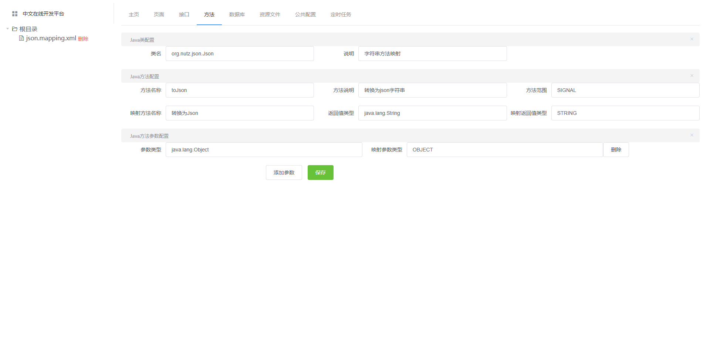

# 中文在线开发平台

***演示地址：http://www.wangzc.icu***

## 前言
这是一个能让没有学过开发的人也能进行前后端开发的中文在线平台（未来期望），所有界面全中文提示，开发常用的数据库、后端、前端等，均可通过平台实现，让所有人都能享受开发的乐趣。

ps：理想很丰满，现实很骨感，项目面临各种的技术问题，特别是前端的UI更是让本人头大，本人技术有限，期望各位大佬能不吝指导，万分感谢

## 项目用途
1. 没有学过开发的人员，能通过该项目了解开发的流程以及基本的原理。
2. 可通过该平台实现简单的小项目，例如家庭记账、物品管理等。
3. 对于需要频繁改动代码的项目，公司又没有开发人员，那么可以将其放到该项目下，让不会开发的人员也能编写接口逻辑。

## 项目使用到的技术
1. element-ui
2. vue
3. java
4. springboot

## 开发计划
状态|模块|功能|描述|问题
:--:|:---|:---|:---|:---
完成|接口代码编辑器|变量定义/引用|定义/应用变量，包括数字、字符串、布尔、数组、map|
完成|接口代码编辑器|逻辑语句|判断语句、循环语句|
完成|接口代码编辑器|其他语句|控制台打印、空行、注释、返回|
完成|接口代码编辑器|方法定义与调用|定义内部方法以及调用|
未完成|接口代码编辑器|表达式语句|加减乘除大于小于等于与或非|没有括号，优先级存在问题，会导致加法在前乘法在后
未完成|接口代码编辑器|数据库语句|构建数据库查询语句，实现数据库操作|数据库管理功能暂未开发
未完成|接口代码编辑器|其他|编辑器的代码校验、自动代码提示等|功能未完成
未完成|Java方法映射|方法映射编辑器|将Java类和方法与接口代码进行关联映射，使接口代码能直接调用Java方法|功能未完成
未完成|数据库管理|管理数据库和表结构|可直接使用中文表名字段来管理数据库|功能未开发
未完成|配置管理|管理公共配置项|公共配置|功能未开发
未完成|定时任务|定时任务管理|定时任务|功能未开发
未完成|资源文件|资源文件管理|管理平台的资源文件|功能未开发
未完成|页面设计|页面设计编辑器|通过平台实现简单的表单、列表等页面|功能未开发
## 演示截图

### 接口代码编辑器演示图

### Java方法映射编辑器演示图

